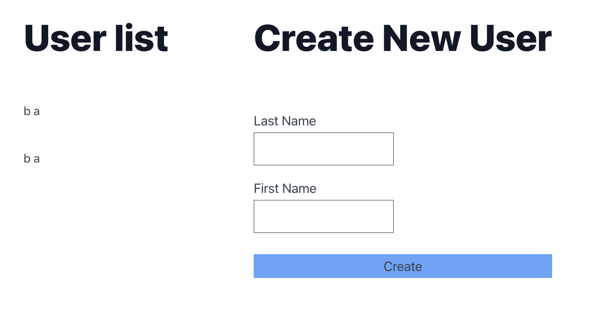

# Coding Test

2 applications

- FrontEnd: Angular application with 2 components to display users and create new one
- BackEnd: Net Core Web Api to delivery RESTful API for FE

## Front End Angular

Frontend application with tailwind integration
* Tailwind
* Tailwind Typography
* Tailwind Form

Adding a separated api client file so that it can be generated from BE side

## Back End Net Core Api

In the backend side, Clean architeture is applied to provide enterprise application experiment and leverage the power of Clean architecture to extend and implement new features and functionalities

### Architecture

| Layer         | Project                          |
| ------------- | -------------------------------- |
| Domain        | CodingTest.Domain                |
| Application   | CodingTest.Core                  |
| Infrastruture | CodingTest.Persistentce.JsonFile |
| Presentation  | CodingTest.Api                   |

### Technologies

* [ASP.NET Core 8](https://docs.microsoft.com/en-us/aspnet/core/introduction-to-aspnet-core)
* [Json file as database](https://github.com/ttu/json-flatfile-datastore)
* [MediatR](https://github.com/jbogard/MediatR)
* [AutoMapper](https://automapper.org/)
* [FluentValidation](https://fluentvalidation.net/)

## References
* Clean architecture [github repository](https://github.com/jasontaylordev/CleanArchitecture)